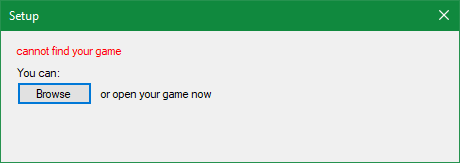
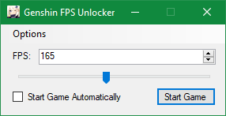
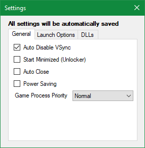
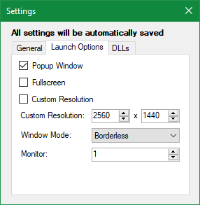
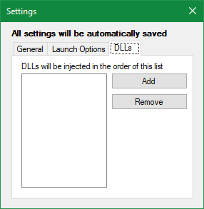

# Genshin Impact Framerate Unlocker

## Features

- This tool helps you to unlock the 60FPS framerate limit from the game
- This is a third-party application which uses **`WriteProcessMemory`** function
- The application applies the desired framerate limit to the running videogame process
- No local videogame files and cache are modified while unlocking the framerate limit
- Protection bypass measures are already included in the application
- The application does not require an additional driver for read-write access
- Support for global version (OS) and chinese version (CN) is available in the application
- Future version updates of the videogame should be very likely to be supported by the application
- Code updates will be provided as soon as possible to keep up with the videogame version
- The compiled binary executables can be downloaded from the [**Releases**](https://github.com/34736384/genshin-fps-unlock/releases) section

## Contributing

> The compilation process was confirmed to work on **Visual Studio 2019 Community Edition**. It might work on other versions as well but there is no guarantee that it will work.

- Fork the repository to your own GitHub namespace
- Ensure that **Visual Studio 2019 Community Edition** is installed
- Ensure that you have the [**Visual C++ 2019 Redistributable (x64)**](https://aka.ms/vs/16/release/vc_redist.x64.exe) package installed
- Ensure that you have the [**.NET Framework 4.8**](https://dotnet.microsoft.com/en-us/download/dotnet-framework/net48) package installed
- Make desired changes to the codebase and compile the codebase into a binary executable
- Place the binary executable in your desired location and start it with **administrator** privileges
- Commit the modifications and make a pull request

## Usage

> The compiled binary executable requires **administrator** privileges because the game requires it. The application simply provides means to launch the videogame process with the framerate unlocked.

> If the application is running for the first time, the application will attempt to find the videogame executable through the registry entry. If the application fails to find the videogame executable, you can locate it by either browsing to its location or by starting it.  
> 

- Download the compiled binary executable from the [**Releases**](https://github.com/34736384/genshin-fps-unlock/releases) section
- Place the binary executable in your desired location and start it with **administrator** privileges  
  
  - Ensure that the videogame is not currently running as the application will automatically launch it with an unlocked framerate
  - Set the framerate limit to your desired framerate using the slider widget or the value adjustment widget
  - Check the "**Start game automatically**" option to launch the videogame with the previously set options
- For advanced settings, open up the **Settings** dialog by navigating **Options** > **Settings** from the menu bar
  - Under the "**General**" section  
    
    - Check the "**Automatically disable V-Sync**" option to prevent locking the videogame framerate to the refresh rate of the display
    - Check the "**Start unlocker minimized**" option to continue on with the previously set options without any changes
    - Check the "**Automatically close on videogame exit**" option to let the application exit when the videogame process terminates
    - Check the "**Enable power saving**" to automatically limit the framerate to 10FPS and to lower the process priority during context switch
    - Set the "**Videogame process priority**" appropriately to ensure that the videogame process gets the computing resources it needs
  - Under the "**Launch**" section  
    
    - Check the "**Run as popup window**" option to seamlessly share input devices across other applications without minimizing the videogame
    - Check the "**Run in fullscreen**" option to run the videogame in a fullscreen window
    - Check the "**Use custom resolution**" option and set the "**Custom resolution**" appropriately to upscale or downscale as per your needs.
    - Set the "**Window mode**" appropriately to prioritize between multi-tasking (using **Borderless**) or raw performance (using **Exclusive**)
    - Select the "**Display on monitor**" option to choose the monitor to render the videogame on
  - Under the "**Injection**" section  
    
    - Use the "**Add DLLs**" to browse and inject DLLs to the videogame process
    - Use the "**Remove DLLs**" to remove the already added DLLs from the videogame process
    - Please note that the DLLs will be injected in the order provided on the list
    - This option is useful for injecting third-party plugins like Reshade etc.
- Do not close the application as it should automatically minimize itself to the tray as the videogame process starts up

## Changelog

### v2.1.0
- Added support for the videogame update version 3.7

### v2.0.0
- Removed support for keybinds and phased out the CLI application
- Added an interactive graphical user interface
- Added support for custom configuration under launch section
- Added numerous quality-of-life features under general section
- Added a slider widget and adjustment textbox for changing framerate limit
- Added an icon for the application executable binary
- Included the installation location detection using registry with fallback

## Notes

My test account is currently at **Adventure Rank 55**. While I cannot guarantee that the usage of the application 
will be safe for the related videogame account going forward, it is highly unlikely for the videogame publisher to
ban videogame accounts for this reason.

Please note that modifying the videogame process memory resident information using an unauthorized and unofficial
third party application can be seen as violation of the videogame's terms of services and the contributors of the 
project assume no responsibility for any harm that might come due to the use of this free and open source project.

## Roadmap
- Maybe, adding localization or support for videogame assets pre-download

# 原神解锁FPS限制

 - 工作原理类似于外部辅助，通过**WriteProcessMemory**把FPS数值写进游戏
 - 不需要通过驱动进行读写操作
 - 支持国服和外服
 - 理论上支持后续版本，不需要更新源码
 - 如果需要更新我会尽快更新

## 编译

 - 用VS2019编译，其他版本的也应该可以，没测试过
## 食用指南
 - 运行前确保系统已安装[Visual C++ 2019 Redistributable (x64)](https://aka.ms/vs/16/release/vc_redist.x64.exe)和[.NET Framework 4.8](https://dotnet.microsoft.com/en-us/download/dotnet-framework/net48)
 - 第一次运行的话先以管理员运行，解锁器会尝试通过注册表寻找游戏路经，如果找不到的话会提示你浏览游戏位置或者开启游戏
 - 解锁器放哪都行
 - 运行之前确保游戏是关闭的
 - 用管理员运行解锁器
 - 解锁器不能关掉
>使用管理员运行是因为游戏必须由解锁器启动，游戏本身就需要管理员权限了，所以负责启动的也是需要的

## 2.0.0 版本更新
 - 看上面的英文版吧，我懒了

## 注意
- 目前我小号冒险等级55了
- 使用未认证的第三方软件修改游戏数据是违反了协议条款的，后果自负
- 要转载的话随便，毕竟开源，可以的话就注明下出处
- 这么个破工具请不要拿去倒卖

## Todo
- 本地化或者游戏预下载
